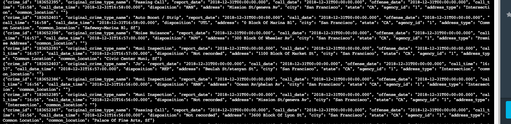
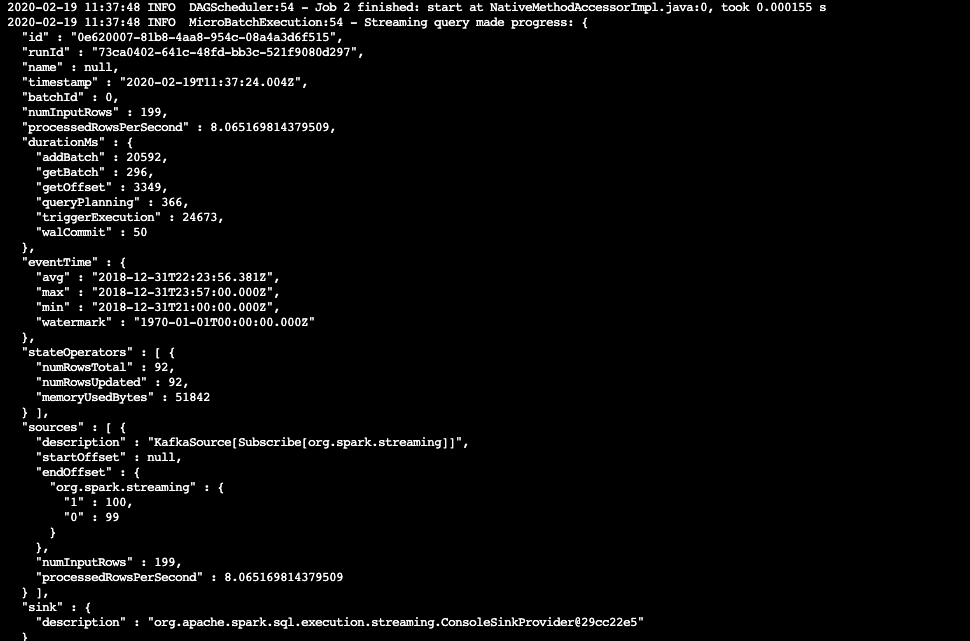
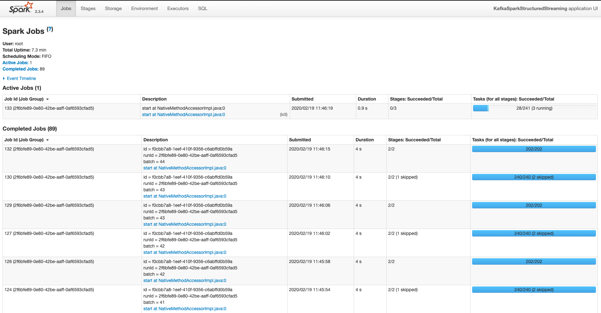
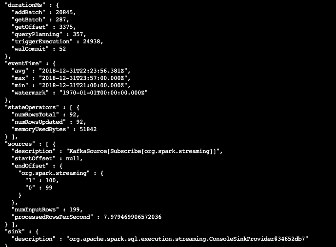
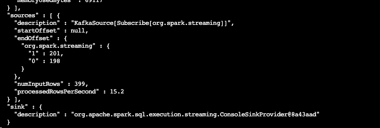

# Spark Streaming Project
## SF Crime Statistics with Spark Streaming

## Goal of the project
The purpose of this project is to create a Kafka server to produce data and ingest data through Spark Structured Streaming.

## Prerequisites/Tools and Technologies used
- Spark 2.4.3
- Scala 2.11.x
- Java 1.8.x
- Kafka build with Scala 2.11.x
- Python 3.6.x or 3.7.x

## Kafka Consumer Console Output

## Progress Reporter Output

## Spark Web UI

## Questions from the project
### How did changing values on the SparkSession property parameters affect the throughput and latency of the data?
- There were clear changes to noth throughput and latency when I manipulated the spark session property parameters. For instance whenever I altered the `maxOffsetsPerTrigger` to a higher value time, I noticed that there was an increase in latency and throughput and if I gave a low value there was a decrease in both throughput and latency. I was able to observe this by how the `numInputRows` and `processedRowsPerSecond` would change on the progress reporter.
### What were the 2-3 most efficient SparkSession property key/value pairs? Through testing multiple variations on values, how can you tell these were the most optimal?
The most efficient SparkSession properties I found were:

#### maxOffsetsPerTrigger 
- When I set the value of `maxOffsetsPerTrigger` at 200, this were the results I would get in the Progress Reporter for both `numInputRows` and `processedRowsPerSecond`:

- When I increased it to 400, there was a clear increase in the `numInputRows` and `processedRowsPerSecond` as shown below:

#### Trigger Processing Time
An increase in the interval time was resulting in a slower delivery of the batches of data while a decrease ensured faster delivery time.

